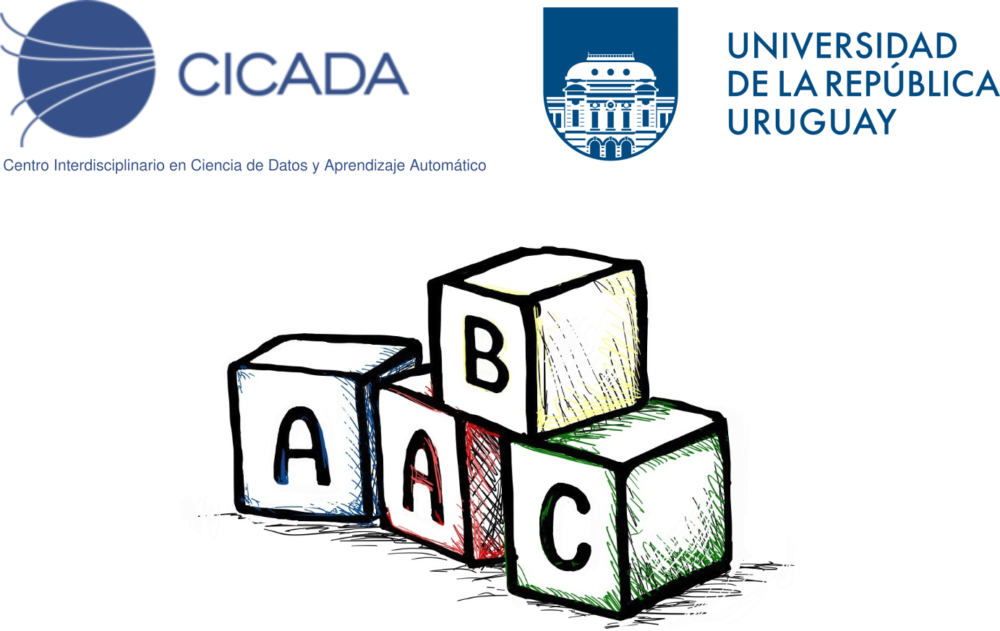

# Aprendizaje Automático Básico para Científicos (AABC)

## Talleres del curso

Este repositorio contiene los cuadernos de Python utilizados en los talleres
de la primera edición del curso de posgrado
[Aprendizaje Automático Básico para Científicos](https://cicada.uy/course/aprendizaje-automatico-basico-para-cientificos-aabc-edicion-2023/)
(AABC), dictado por el Centro Interdisciplinario en Ciencia de
Datos y Aprendizaje Automático (CICADA) de la Universidad de la
República (UdelaR), Uruguay.

Los cuadernos fueron creados por [Ivan Meresman](https://ivanlmh.github.io/)
y [Daniel Herrera-Esposito](https://dherrera1911.github.io/)
para la primera edición del curso en 2021. El responsable del curso
es el Prof. Ignacio Ramírez

El curso AABC usa como referencia el libro
["Introduction to Machine Learning with Python"](https://www.nrigroupindia.com/e-book/Introduction%20to%20Machine%20Learning%20with%20Python%20%28%20PDFDrive.com%20%29-min.pdf)
de Andreas C. Müller y Sarah Guido. Los cuadernos en este repositorio siguen
en parte el contenido del libro, pero todos los cuadernos son
creaciones originales de los autores. Los cuadernos no son
completamente autocontenidos, sino que están pensados para
ser utilizados en conjunto con las clases del curso y con el libro.

Los cuadernos tienen ejercicios de diversas dificultades, con y sin programación,
para que los estudiantes los resuelvan. Debido a que algunos ejercicios
involucran completar código, los cuadernos no corren completamente
sin intervención del estudiante.

## Contenido

Los cuadernos están en la carpeta `notebooks`. El título de cada cuaderno
indica el número de la clase a la que corresponde, y el tema.

* [Clase 1: Introducción al aprendizaje automático](notebooks/Taller1-Introduccion_AA.ipynb)
* [Clase 2: Aprendizaje Supervisado](notebooks/Taller2-Aprendizaje_supervisado.ipynb)
* [Clase 3: Aprendizaje No Supervisado](notebooks/Taller3-Aprendizaje_no_supervisado.ipynb)
* [Clase 4: Representación de los datos](notebooks/Taller4-Representacion_y_modelado.ipynb)
* [Clase 5: Redes neuronales](notebooks/Taller5-Redes_neuronales_Random_forests.ipynb)
* [Clase 6: Evaluación de modelos](notebooks/Taller6-Evaluacion_de_modelos.ipynb)
* [Clase 7: Aplicaciones, Spike sorting](notebooks/Taller7-Aplicaciones.ipynb)

Los cuadernos también usan datos que están en la carpeta `data`. Los datos
que se encuentran en esta carpeta son:
* `blood_images.zip` y `blood_labels.csv`: Imágenes de células sanguíneas
  para un problema de clasificación de imágenes. Los datos fueron
  obtenidos de [este repositorio](https://www.kaggle.com/datasets/paultimothymooney/blood-cells).
  Los datos fueron curados para quitar imagenes sin glóbulos blancos o
  con más de uno.
* `iq_data.csv`: Resultados de un test de IQ online gratuito, de 
  [https://openpsychometrics.org](https://openpsychometrics.org). Los datos se
  descargan de [este enlace](https://openpsychometrics.org/_rawdata/FSIQ_0.1_data.zip).
* `data_texto.zip`: Reviews de películas de la página IMDB. Los datos
  fueron obtenidos de [este repositorio](https://ai.stanford.edu/~amaas/data/sentiment/).
* `leaves_train.csv`: Datos de hojas para un problema de clasificación
  de imágenes. Los datos fueron obtenidos de
 [este repositorio](https://www.kaggle.com/c/leaf-classification/data).

## Instrucciones

Estos cuadernos pueden ser corridos desde Google Colab.
1) Vaya a la página de Google Colab: https://colab.research.google.com/
2) Haga click en "File" -> "Open Notebook" -> "GitHub"
3) Pegue la URL de este repositorio en el campo de búsqueda y seleccione
  el cuaderno que quiere abrir, o pegue directamente la URL de un
  cuaderno específico.

